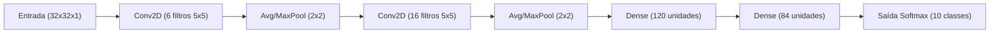

# 🧠 Ciência de Dados em Python: Reconhecimento de Dígitos com MNIST e Redes Convolucionais (CNN / LeNet-5)

[](https://www.python.org/)
[](https://www.tensorflow.org/)
[](https://keras.io/)
[](https://numpy.org/)
[](https://matplotlib.org/)
[](https://seaborn.pydata.org/)
[](https://colab.research.google.com/drive/1qq1aWl2uJs-BvFPtWcjmUAmY2Gxi3-PC#scrollTo=edkI5lnRDLXR)

Repositório dedicado ao estudo e implementação prática de **Visão Computacional** e **Deep Learning** aplicados ao reconhecimento de dígitos manuscritos da base **MNIST**. O projeto aborda desde as etapas fundamentais de pré-processamento de imagens matriciais (com adaptação para a clássica rede **LeNet-5**) até a construção, treinamento e avaliação de uma **Rede Neural Convolucional (CNN)** moderna com análise de desempenho via **Matriz de Confusão**.

---

## 📌 Sumário
- [Visão Geral](#-visão-geral)
- [O Dataset MNIST](#-o-dataset-mnist)
- [Estrutura do Repositório](#-estrutura-do-repositório)
- [Pipeline de Pré-processamento](#-pipeline-de-pré-processamento)
  - [1. Carregamento dos Dados](#1-carregamento-dos-dados)
  - [2. Visualização e Inspeção Visual](#2-visualização-e-inspeção-visual)
  - [3. Separação dos Conjuntos e Expansão de Dimensão](#3-separação-dos-conjuntos-e-expansão-de-dimensão)
  - [4. Preenchimento de Zeros (Zero-Padding para 32x32)](#4-preenchimento-de-zeros-zero-padding-para-32x32)
  - [5. Normalização dos Dados (Escala [0.0, 1.0])](#5-normalização-dos-dados-escala-00-10)
- [Modelo Convolucional e Avaliação](#-modelo-convolucional-e-avaliação)
  - [6. Construção e Treinamento da CNN (`newton.py`)](#6-construção-e-treinamento-da-cnn-newtonpy)
  - [7. Avaliação e Matriz de Confusão (`newton2.py`)](#7-avaliação-e-matriz-de-confusão-newton2py)
- [A Arquitetura Clássica LeNet-5](#-a-arquitetura-clássica-lenet-5)
- [Como Executar o Projeto](#-como-executar-o-projeto)
  - [Instalação das Dependências](#1-instalação-das-dependências)
  - [Execução Rápida do Pipeline](#2-execução-rápida-do-pipeline)
  - [Treinamento do Modelo e Matriz de Confusão](#3-treinamento-do-modelo-e-matriz-de-confusão)
  - [Execução no Google Colab](#4-execução-no-google-colab)
- [Perguntas Frequentes & Solução de Problemas](#-perguntas-frequentes--solução-de-problemas)
- [Referências e Links Úteis](#-referências-e-links-úteis)

---

## 📖 Visão Geral

Neste projeto de Ciência da Computação e Ciência de Dados, exploramos todo o ciclo de vida de uma aplicação de aprendizado profundo para classificação de imagens:

1. **Engenharia de Dados e Tensores:** Carregamento, particionamento treino/validação/teste, adequação de dimensionalidade 4D `(batch, altura, largura, canais)`, zero-padding para padronização de resolução e normalização numérica dos pixels.
2. **Modelagem Convolucional:** Construção de redes convolucionais profundas (CNNs) utilizando **Keras** e **TensorFlow**, explorando camadas de convolução 2D, pooling e camadas totalmente conectadas (Dense).
3. **Avaliação Diagnóstica:** Métricas de acurácia por época, função de custo categórica e diagnóstico minucioso de predições com mapas de calor (Heatmaps) da matriz de confusão via **Seaborn**.

---

## 📊 O Dataset MNIST

O **MNIST** (*Modified National Institute of Standards and Technology*) é o benchmark clássico do aprendizado de máquina e visão computacional:

- **Volume Total:** 70.000 imagens em escala de cinza com dígitos de $0$ a $9$.
- **Divisão Tradicional:** 60.000 imagens de treino e 10.000 imagens de teste.
- **Divisão com Validação (LeNet-5):** 55.000 para **treinamento**, 5.000 para **validação** e 10.000 para **testes**.
- **Resolução Original:** $28 \times 28$ pixels.
- **Adaptação LeNet-5:** $32 \times 32$ pixels com preenchimento de bordas (*Zero-Padding*).

```
Matriz 2D (28x28)             Padding (32x32)             Normalização [0, 1]          Rótulo
   [ [ 0, 255, ... ],  =====>   + 2px borda zeros  =====>      Dividido por 255   =====>   "5"
     [ 0, 128, ... ] ]          (zeros ao redor)              (0.0 a 1.0)
```

---

## 📂 Estrutura do Repositório

```text
CienciaDeDadosEmPython/
│
├── requirements.txt         # Dependências do projeto (TensorFlow, Keras, NumPy, Matplotlib, Seaborn)
│
├── 🧠 Treinamento e Avaliação da Rede Convolucional (CNN):
│   ├── newton.py            # Definição da CNN, codificação one-hot, compilação e treinamento
│   └── newton2.py           # Cálculo e exibição da Matriz de Confusão com Seaborn Heatmap
│
├── ⚙️ Pipeline de Pré-processamento (Passo a Passo e Modular):
│   ├── data_loader.py       # Etapa 1: Carregamento inicial do dataset MNIST
│   ├── visualization.py     # Etapa 2: Visualização gráfica simples com Matplotlib
│   ├── visualizacao_mnist.py# Etapa 2: Módulo autônomo com carregamento e plotagem
│   ├── data_split.py        # Etapa 3: Separação em Treino (55k), Validação (5k) e Teste (10k)
│   ├── data_padding.py      # Etapa 4: Aplicação de Zero-Padding (28x28 -> 32x32)
│   ├── padding.py           # Etapa 4: Módulo autônomo integrando carga, split e padding
│   ├── data_normalization.py# Etapa 5: Normalização dos pixels para o intervalo [0.0, 1.0]
│   └── executar.py          # Script unificado que executa o pipeline completo (Etapas 1 a 5)
│
├── 📝 Snippets das Aulas:
│   ├── 03PY.py              # Snippet da Etapa 3 (Split e expansão de dimensão)
│   ├── 04PY.py              # Snippet da Etapa 4 (Zero-Padding)
│   └── 05PY.py              # Snippet da Etapa 5 (Normalização dos dados)
│
├── 📚 Roteiros e Guias de Estudo:
│   ├── Implementação.md     # Roteiro teórico da Parte 1 (Carga e visualização)
│   ├── Implementação2.md    # Roteiro teórico da Parte 2 (Divisão dos conjuntos)
│   ├── Implementação3.md    # Roteiro teórico da Parte 3 (Padding de entrada)
│   ├── Implementação4.md    # Roteiro teórico da Parte 4 (Normalização dos dados)
│   └── Instrucoes.md        # Guia prático com comandos e saídas esperadas
│
├── imagem.png               # Amostra visual gerada dos 5 primeiros dígitos do MNIST
├── README.md                # Documentação completa do repositório
└── LICENSE                  # Licença de uso
```

---

## 🛠️ Pipeline de Pré-processamento

### 1. Carregamento dos Dados
Implementado em [`data_loader.py`](data_loader.py) e [`visualizacao_mnist.py`](visualizacao_mnist.py):

```python
import tensorflow as tf

# Download e carregamento automático das matrizes brutas
(x_treino, y_treino), (x_teste, y_teste) = tf.keras.datasets.mnist.load_data()
```

- **Features (`x`):** Tensores contendo os valores inteiros dos pixels no formato inicial `(60000, 28, 28)`.
- **Labels (`y`):** Vetores com os números verdadeiros correspondentes a cada imagem ($0$ a $9$).

---

### 2. Visualização e Inspeção Visual
Implementado em [`visualization.py`](visualization.py) e [`visualizacao_mnist.py`](visualizacao_mnist.py):

```python
import matplotlib.pyplot as plt

# Exibe os 5 primeiros dígitos do conjunto de treinamento
for i in range(5):
    plt.subplot(1, 5, i + 1)
    plt.tight_layout()
    plt.imshow(x_treino[i].reshape(28, 28), cmap='gray')
    plt.title(f'Rótulo: {y_treino[i]}')
    plt.xticks([])
    plt.yticks([])

plt.show()
```

#### Saída gerada:
<p align="center">
  
</p>

| Amostra 1 | Amostra 2 | Amostra 3 | Amostra 4 | Amostra 5 |
| :---: | :---: | :---: | :---: | :---: |
| **5** | **0** | **4** | **1** | **9** |
| `Rótulo: 5` | `Rótulo: 0` | `Rótulo: 4` | `Rótulo: 1` | `Rótulo: 9` |

---

### 3. Separação dos Conjuntos e Expansão de Dimensão
Implementado em [`data_split.py`](data_split.py) e [`03PY.py`](03PY.py):

```python
import numpy as np
 
quantidade_dados_treino = 55000
 
# 1. Separação do conjunto de validação (5.000 amostras) + canal de cor
x_validacao = x_treino[quantidade_dados_treino:, ..., np.newaxis]
y_validacao = y_treino[quantidade_dados_treino:]

# 2. Ajuste do conjunto de treino (55.000 amostras) + canal de cor
x_treino = x_treino[:quantidade_dados_treino, ..., np.newaxis]
y_treino = y_treino[:quantidade_dados_treino]
 
# 3. Adição do canal ao conjunto de testes (10.000 amostras)
x_teste = x_teste[..., np.newaxis]
```

- **Por que `np.newaxis`?** As camadas `Conv2D` exigem tensores 4D no formato `(batch, altura, largura, canais)`. Para imagens em escala de cinza, expande-se de `(28, 28)` para `(28, 28, 1)`.

---

### 4. Preenchimento de Zeros (Zero-Padding para 32x32)
Implementado em [`data_padding.py`](data_padding.py), [`padding.py`](padding.py) e [`04PY.py`](04PY.py):

A entrada clássica da LeNet-5 foi projetada para dimensões de $32 \times 32$. Para adaptar as matrizes $28 \times 28$, adicionam-se 2 pixels de preenchimento (`0`) em cada borda:

$$28 + 2 + 2 = 32$$

```python
# Adiciona 2 pixels de zeros nas bordas: ((batch), (altura), (largura), (canal))
x_treino = np.pad(x_treino, ((0,0), (2,2), (2,2), (0,0)), 'constant')
x_validacao = np.pad(x_validacao, ((0,0), (2,2), (2,2), (0,0)), 'constant')
x_teste = np.pad(x_teste, ((0,0), (2,2), (2,2), (0,0)), 'constant')
```

---

### 5. Normalização dos Dados (Escala [0.0, 1.0])
Implementado em [`data_normalization.py`](data_normalization.py) e [`05PY.py`](05PY.py):

```python
normalizar_dados = lambda t: t / 255.0

x_treino = normalizar_dados(x_treino)
x_validacao = normalizar_dados(x_validacao)
x_teste = normalizar_dados(x_teste)
```

#### Resumo das Dimensões e Tipos ao Longo do Pipeline:

| Etapa | Formato do Tensor de Treino | Tipo de Dado | Intervalo de Valores |
| :--- | :---: | :---: | :---: |
| **1. Carga Bruta** | `(60000, 28, 28)` | `uint8` | $[0, 255]$ |
| **2. Split + Expansão** | `(55000, 28, 28, 1)` | `uint8` | $[0, 255]$ |
| **3. Zero-Padding** | `(55000, 32, 32, 1)` | `uint8` | $[0, 255]$ |
| **4. Normalização** | **`(55000, 32, 32, 1)`** | **`float32 / float64`** | **$[0.0, 1.0]$** |

---

## 🤖 Modelo Convolucional e Avaliação

### 6. Construção e Treinamento da CNN (`newton.py`)

No arquivo [`newton.py`](newton.py), implementamos e treinamos uma Rede Neural Convolucional multicamadas utilizando a API Sequencial do **Keras**:

```python
import tensorflow as tf
from keras import layers, models, utils
from keras.datasets import mnist

# 1. Carregamento dos dados MNIST
(train_images, train_labels), (test_images, test_labels) = mnist.load_data()

# 2. Pré-processamento e normalização
train_images = train_images.reshape((60000, 28, 28, 1)).astype('float32') / 255
test_images = test_images.reshape((10000, 28, 28, 1)).astype('float32') / 255

# 3. Codificação One-Hot dos rótulos
train_labels = utils.to_categorical(train_labels)
test_labels = utils.to_categorical(test_labels)

# 4. Construção da arquitetura CNN
model = models.Sequential([
    layers.Input(shape=(28, 28, 1)),
    layers.Conv2D(32, (3, 3), activation='relu'),
    layers.MaxPooling2D((2, 2)),
    layers.Conv2D(64, (3, 3), activation='relu'),
    layers.MaxPooling2D((2, 2)),
    layers.Conv2D(64, (3, 3), activation='relu'),
    layers.Flatten(),
    layers.Dense(64, activation='relu'),
    layers.Dense(10, activation='softmax')
])

# 5. Compilação do modelo
model.compile(
    optimizer='adam',
    loss='categorical_crossentropy',
    metrics=['accuracy']
)

# 6. Treinamento
model.fit(
    train_images, train_labels,
    epochs=5,
    batch_size=64,
    validation_data=(test_images, test_labels)
)
```

#### Detalhamento das Camadas da CNN:
1. **`Input(shape=(28, 28, 1))`**: Define formalmente o formato do tensor de entrada.
2. **`Conv2D(32, (3, 3))` + ReLU**: 32 filtros convolucionais para extração de bordas e curvas básicas.
3. **`MaxPooling2D((2, 2))`**: Redução espacial (subamostragem), reduzindo dimensões pela metade e garantindo invariância a pequenas translações.
4. **`Conv2D(64, (3, 3))` + ReLU**: 64 filtros para combinar características em padrões mais complexos.
5. **`MaxPooling2D((2, 2))`**: Nova redução espacial.
6. **`Conv2D(64, (3, 3))` + ReLU**: Camada convolucional profunda para detectar detalhes de alto nível dos dígitos.
7. **`Flatten`**: Converte o volume 3D em um vetor 1D para conectar às camadas totalmente conectadas.
8. **`Dense(64)` + ReLU**: Camada densa intermediária de aprendizado não-linear de alto nível.
9. **`Dense(10)` + Softmax**: Camada final que gera a distribuição de probabilidade normalizada sobre as 10 classes de dígitos ($0$ a $9$).

---

### 7. Avaliação e Matriz de Confusão (`newton2.py`)

No arquivo [`newton2.py`](newton2.py), realizamos a avaliação visual diagnóstica através da plotagem da **Matriz de Confusão**:

```python
import matplotlib.pyplot as plt
import numpy as np
import seaborn as sns
import tensorflow as tf

def plot_confusion_matrix(model, test_images, test_labels):
    """Gera e exibe a matriz de confusão para o modelo treinado."""
    predictions = model.predict(test_images, verbose=0)
    predicted_labels = np.argmax(predictions, axis=1)
    true_labels = np.argmax(test_labels, axis=1) if test_labels.ndim > 1 else test_labels

    confusion_matrix = tf.math.confusion_matrix(
        labels=true_labels,
        predictions=predicted_labels,
        num_classes=10
    ).numpy()

    plt.figure(figsize=(10, 8))
    sns.heatmap(confusion_matrix, annot=True, fmt='d', cmap='viridis')
    plt.xlabel('Classe Predita')
    plt.ylabel('Classe Verdadeira')
    plt.title('Matriz de Confusão - MNIST')
    plt.tight_layout()
    plt.show()

    return confusion_matrix
```

#### Por que utilizar a Matriz de Confusão?
- **Identificação de Confusões Frequentes**: Permite visualizar exatamente quais dígitos o modelo tende a confundir (por exemplo, confundir dígitos graficamente semelhantes como $4$ e $9$, ou $3$ e $5$).
- **Falsos Positivos vs. Falsos Negativos**: Vai além da acurácia global, mostrando a precisão individual para cada uma das 10 classes.

---

## 🏛️ A Arquitetura Clássica LeNet-5

Projetada por *Yann LeCun et al.* em 1998, a rede **LeNet-5** é o marco seminal que inaugurou o uso prático de redes neurais convolucionais:



| Camada | Tipo | Formato de Entrada | Formato de Saída | Parâmetros / Ativação |
| :---: | :---: | :---: | :---: | :---: |
| **Input** | Imagem com Padding | `(32, 32, 1)` | `(32, 32, 1)` | - |
| **C1** | Convolução 2D | `(32, 32, 1)` | `(28, 28, 6)` | 6 filtros $5\times5$, tanh |
| **S2** | Subamostragem / Pooling | `(28, 28, 6)` | `(14, 14, 6)` | Pool $2\times2$, stride 2 |
| **C3** | Convolução 2D | `(14, 14, 6)` | `(10, 10, 16)` | 16 filtros $5\times5$, tanh |
| **S4** | Subamostragem / Pooling | `(10, 10, 16)` | `(5, 5, 16)` | Pool $2\times2$, stride 2 |
| **C5 / F5** | Camada Densa / Convolução | `(5, 5, 16)` | `(120)` | 120 unidades, tanh |
| **F6** | Camada Densa | `(120)` | `(84)` | 84 unidades, tanh |
| **Output** | Camada Densa Final | `(84)` | `(10)` | 10 classes, softmax |

---

## 🚀 Como Executar o Projeto

### 1. Instalação das Dependências

Recomenda-se utilizar um ambiente virtual (`venv`). Para instalar todas as dependências listadas no [`requirements.txt`](requirements.txt):

```powershell
pip install -r requirements.txt
```

As principais bibliotecas e suas versões mínimas recomendadas são:
- `tensorflow >= 2.20.0`
- `keras >= 3.0.0`
- `numpy >= 2.0.0`
- `matplotlib >= 3.10.0`
- `seaborn >= 0.13.0`

---

### 2. Execução Rápida do Pipeline

Para executar o pipeline completo de preparação dos dados da LeNet-5 (carga, visualização gráfica, split, padding e normalização):

```powershell
python executar.py
```

> **Dica:** Quando a janela com os 5 primeiros dígitos abrir na tela, feche-a para que o script prossiga com os passos subsequentes no terminal.

---

### 3. Treinamento do Modelo e Matriz de Confusão

#### Opção A: Treinar a CNN
```powershell
python newton.py
```
O script fará o download do MNIST (caso ainda não esteja em cache), formatará as matrizes, compilará o modelo e executará as 5 épocas de treinamento exibindo o progresso, acurácia e perda por lote.

#### Opção B: Treinar e Exibir a Matriz de Confusão com Seaborn
```powershell
python newton2.py
```
O script importa o modelo treinado de `newton.py`, gera previsões sobre o conjunto de teste de 10.000 imagens e abre uma janela com o gráfico Heatmap interativo da **Matriz de Confusão**.

---

### 4. Execução no Google Colab

Você pode rodar todo o projeto na nuvem via Google Colab clicando no badge:

[](https://colab.research.google.com/drive/1qq1aWl2uJs-BvFPtWcjmUAmY2Gxi3-PC#scrollTo=edkI5lnRDLXR)

👉 **[Acessar Notebook no Google Colab](https://colab.research.google.com/drive/1qq1aWl2uJs-BvFPtWcjmUAmY2Gxi3-PC#scrollTo=edkI5lnRDLXR)**

---

## ❓ Perguntas Frequentes & Solução de Problemas

<details>
<summary><b>1. Como instalar rapidamente todas as bibliotecas necessárias?</b></summary>
Basta executar no terminal:
<code>pip install -r requirements.txt</code>
Isso instalará TensorFlow, Keras, NumPy, Matplotlib e Seaborn de uma só vez.
</details>

<details>
<summary><b>2. Erro: <code>import: The term 'import' is not recognized</code></b></summary>
Esse erro ocorre ao digitar comandos Python diretamente no prompt do PowerShell. Códigos Python devem ser salvos em arquivos <code>.py</code> ou executados chamando <code>python seu_arquivo.py</code>.
</details>

<details>
<summary><b>3. Erro: <code>NameError: name 'x_treino' is not defined</code> ao rodar scripts isolados</b></summary>
Alguns scripts curtos de estudo (como <code>03PY.py</code>, <code>04PY.py</code>, <code>05PY.py</code>) são trechos conceituais das aulas. Para executar de forma autônoma sem dependências externas, utilize os scripts modulares completos como <code>visualizacao_mnist.py</code>, <code>padding.py</code>, <code>data_normalization.py</code> ou o script integrado <code>executar.py</code>.
</details>

<details>
<summary><b>4. Ao executar <code>newton2.py</code>, o modelo treina novamente?</b></summary>
Sim, pois <code>newton2.py</code> importa <code>model</code> diretamente do módulo <code>newton.py</code>. Como o código de treinamento em <code>newton.py</code> está no escopo global do módulo, o Keras executa o treinamento antes de repassar os pesos para a geração da Matriz de Confusão.
</details>

<details>
<summary><b>5. O treinamento roda em GPU ou CPU?</b></summary>
O TensorFlow detecta automaticamente se há placas NVIDIA com CUDA/cuDNN instaladas. Caso não haja GPU dedicada configurada, o treinamento será executado na CPU sem necessidade de alterações no código.
</details>

---

## 📚 Referências e Links Úteis

- [Notebook do Projeto no Google Colab](https://colab.research.google.com/drive/1qq1aWl2uJs-BvFPtWcjmUAmY2Gxi3-PC#scrollTo=edkI5lnRDLXR)
- [LeCun et al., 1998 - Gradient-Based Learning Applied to Document Recognition (Artigo Original LeNet-5)](http://vision.stanford.edu/cs598_spring07/papers/Lecun98.pdf)
- [Documentação Oficial do TensorFlow Keras](https://www.tensorflow.org/api_docs/python/tf/keras)
- [Documentação do Matplotlib](https://matplotlib.org/stable/contents.html)
- [Documentação da Biblioteca Seaborn](https://seaborn.pydata.org/)