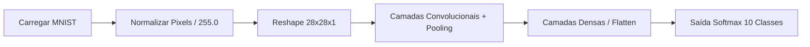

# 🧠 Ciência de Dados em Python: Reconhecimento de Dígitos com MNIST e LeNet-5

[](https://www.python.org/)
[](https://www.tensorflow.org/)
[](https://keras.io/)
[](https://matplotlib.org/)

Repositório dedicado ao estudo e implementação prática de **Visão Computacional** e **Deep Learning** aplicados ao reconhecimento de dígitos manuscritos da base **MNIST**, utilizando a clássica arquitetura de Rede Neural Convolucional (CNN) **LeNet-5**.

---

## 📌 Sumário
- [Visão Geral](#-visão-geral)
- [O Dataset MNIST](#-o-dataset-mnist)
- [Estrutura do Repositório](#-estrutura-do-repositório)
- [Passo a Passo da Implementação](#-passo-a-passo-da-implementação)
  - [1. Carregamento dos Dados](#1-carregamento-dos-dados)
  - [2. Visualização e Inspeção Visual](#2-visualização-e-inspeção-visual)
  - [3. Próximas Etapas: Pipeline LeNet-5](#3-próximas-etapas-pipeline-lenet-5)
- [Como Executar o Projeto](#-como-executar-o-projeto)
  - [Opção 1: Execução Local (VS Code / Terminal)](#opção-1-execução-local-vs-code--terminal)
  - [Opção 2: Execução no Google Colab / Jupyter](#opção-2-execução-no-google-colab--jupyter)
- [Perguntas Frequentes & Solução de Problemas](#-perguntas-frequentes--solução-de-problemas)

---

## 📖 Visão Geral

Neste projeto de Ciência da Computação e Ciência de Dados, exploramos desde a coleta e exploração dos dados até o treinamento de uma rede neural convolucional.

A arquitetura **LeNet-5**, desenvolvida por *Yann LeCun et al.* em 1998, é uma das pioneiras no processamento de imagens matriciais e serviu de alicerce para os modelos modernos de aprendizado profundo.

---

## 📊 O Dataset MNIST

O **MNIST** (*Modified National Institute of Standards and Technology*) é o dataset "Hello World" do aprendizado de máquina:

- **Volume Total:** 70.000 imagens em escala de cinza de dígitos de $0$ a $9$.
- **Divisão:** 60.000 amostras para **treinamento** e 10.000 para **testes**.
- **Resolução:** $28 \times 28$ pixels por imagem (valores de intensidade de 0 a 255).

```
Matriz 2D de Pixels (28x28)                Rótulo (Ground Truth)
   [ [  0,   0,   0, ... ],                      
     [  0, 253, 255, ... ],        ======>           "5"
     [  0,   0,   0, ... ] ]
```

---

## 📂 Estrutura do Repositório

```text
CienciaDeDadosEmPython/
│
├── data_loader.py        # Etapa 1: Script de carregamento e particionamento dos dados
├── visualization.py      # Etapa 2: Script de plotagem dos primeiros dígitos com Matplotlib
├── executar.py          # Script unificado para execução direta (Treino + Plotagem)
├── imagem.png           # Saída visual dos 5 primeiros dígitos da base MNIST
├── Implementação.md     # Roteiro teórico e didático da aula
├── README.md            # Documentação completa do projeto
└── LICENSE              # Licença de uso
```

---

## 🛠️ Passo a Passo da Implementação

### 1. Carregamento dos Dados
Implementado no arquivo [`data_loader.py`](data_loader.py):

```python
import tensorflow as tf

# Download e separação automática dos dados
(x_treino, y_treino), (x_teste, y_teste) = tf.keras.datasets.mnist.load_data()
```

#### Entendendo as variáveis:
- **`x_treino` e `x_teste` ($X$ - Features):** Tensores contendo as matrizes de pixels das imagens. Formato: `(60000, 28, 28)`.
- **`y_treino` e `y_teste` ($Y$ - Labels / Classes):** Vetores com os números reais (0 a 9) que a rede deve aprender a prever.

---

### 2. Visualização e Inspeção Visual
Implementado no arquivo [`visualization.py`](visualization.py):

```python
import matplotlib.pyplot as plt

# Exibe os 5 primeiros dígitos do conjunto de treinamento
for i in range(5):
    plt.subplot(1, 5, i + 1)
    plt.tight_layout()
    plt.imshow(x_treino[i].reshape(28, 28), cmap='gray')
    plt.title('Rótulo: {}'.format(y_treino[i]))
    plt.xticks([])  # Remove eixos numéricos
    plt.yticks([])

plt.show()
```

#### Saída esperada:
A execução do código gera a seguinte visualização gráfica com os 5 primeiros registros e seus respectivos rótulos:

<p align="center">
  
</p>

| Amostra 1 | Amostra 2 | Amostra 3 | Amostra 4 | Amostra 5 |
| :---: | :---: | :---: | :---: | :---: |
| **5** | **0** | **4** | **1** | **9** |
| `Rótulo: 5` | `Rótulo: 0` | `Rótulo: 4` | `Rótulo: 1` | `Rótulo: 9` |

> **Por que essa etapa é essencial?**
> A inspeção visual é um *sanity check* fundamental. Ela confirma se o carregamento foi íntegro, se o formato dos dados está preservado e se os rótulos correspondem exatamente às imagens.

---

### 3. Próximas Etapas: Pipeline LeNet-5

Para finalizar o treinamento da rede **LeNet-5**, o pipeline completo segue o seguinte fluxo:



1. **Normalização:** Escalar valores de `[0, 255]` para `[0.0, 1.0]` dividindo por `255.0` (acelera a convergência do gradiente).
2. **Ajuste de Dimensão (Reshape):** Converter para `(batch, 28, 28, 1)` para indicar canal único (escala de cinza).
3. **Construção do Modelo LeNet-5:**
   - **Conv2D** ($6$ filtros $5\times5$, ativação `tanh` ou `relu`)
   - **AveragePooling2D / MaxPooling2D** ($2\times2$, stride 2)
   - **Conv2D** ($16$ filtros $5\times5$)
   - **AveragePooling2D / MaxPooling2D** ($2\times2$)
   - **Dense** (120 neurônios) $\rightarrow$ **Dense** (84 neurônios) $\rightarrow$ **Dense** (10 saídas com `softmax`).

---

## 🚀 Como Executar o Projeto

### Opção 1: Execução Local (VS Code / Terminal)

#### 1. Clonar o repositório ou abrir a pasta
```powershell
cd c:\Repo2026\CienciaDeDadosEmPython
```

#### 2. Instalar as dependências
```powershell
pip install tensorflow matplotlib
```

#### 3. Executar o script unificado
Execute o script [`executar.py`](executar.py):
```powershell
python executar.py
```
> Ou abra o arquivo [`executar.py`](executar.py) no seu editor e clique no botão **Play (▶️)** no canto superior direito.

---

### Opção 2: Execução no Google Colab / Jupyter

Se preferir rodar em ambiente de nuvem interativo:

1. Acesse [Google Colab](https://colab.research.google.com/) e crie um **Novo Notebook**.
2. **Célula 1 (Carregamento):**
   ```python
   import tensorflow as tf
   (x_treino, y_treino), (x_teste, y_teste) = tf.keras.datasets.mnist.load_data()
   ```
3. **Célula 2 (Visualização):**
   ```python
   import matplotlib.pyplot as plt

   for i in range(5):
       plt.subplot(1, 5, i + 1)
       plt.tight_layout()
       plt.imshow(x_treino[i].reshape(28, 28), cmap='gray')
       plt.title(f'Rótulo: {y_treino[i]}')
       plt.xticks([])
       plt.yticks([])
   plt.show()
   ```

---

## ❓ Perguntas Frequentes & Solução de Problemas

<details>
<summary><b>1. Erro: <code>import: The term 'import' is not recognized</code></b></summary>
Esse erro ocorre quando tentamos digitar comandos Python diretamente no terminal do PowerShell. O PowerShell executa comandos do sistema (como <code>python</code>, <code>pip</code>), enquanto códigos Python (como <code>import ...</code>) devem ficar dentro de um arquivo <code>.py</code> ou ser executados no console interativo do Python.
</details>

<details>
<summary><b>2. Erro: <code>NameError: name 'x_treino' is not defined</code> ao rodar visualization.py</b></summary>
Os arquivos <code>data_loader.py</code> e <code>visualization.py</code> foram feitos originalmente como células de aula. Para executar localmente em um único comando, utilize o arquivo <code>executar.py</code>, que une o carregamento e a plotagem.
</details>

---

## 📚 Referências e Links Úteis
- [LeCun et al., 1998 - Gradient-Based Learning Applied to Document Recognition (LeNet-5)](http://vision.stanford.edu/cs598_spring07/papers/Lecun98.pdf)
- [Documentação Oficial do TensorFlow Keras](https://www.tensorflow.org/api_docs/python/tf/keras)
- [Documentação do Matplotlib](https://matplotlib.org/stable/contents.html)